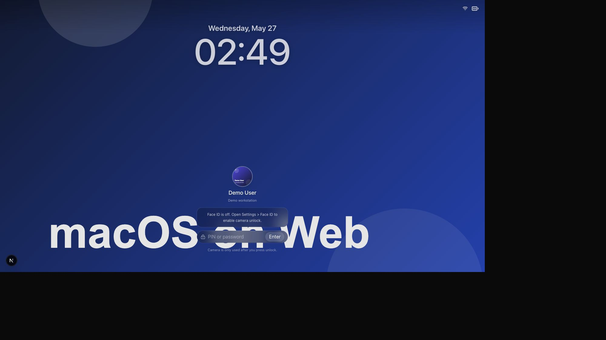
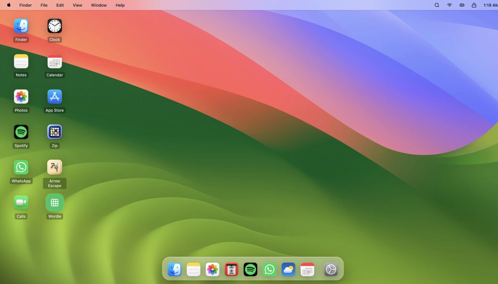
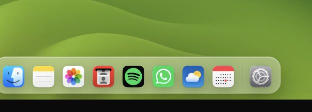
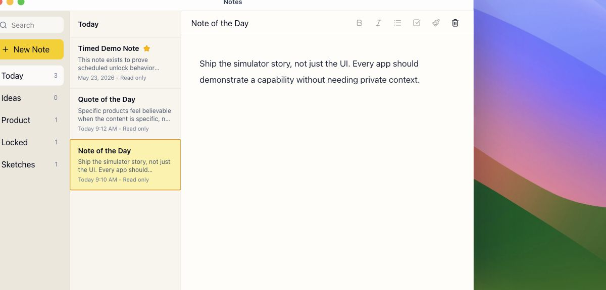
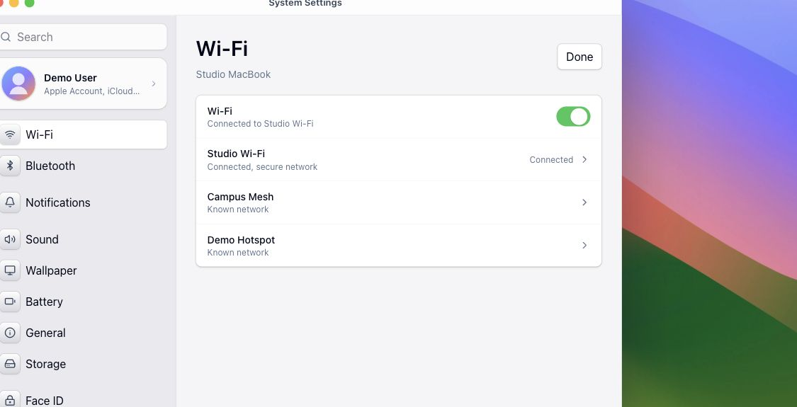
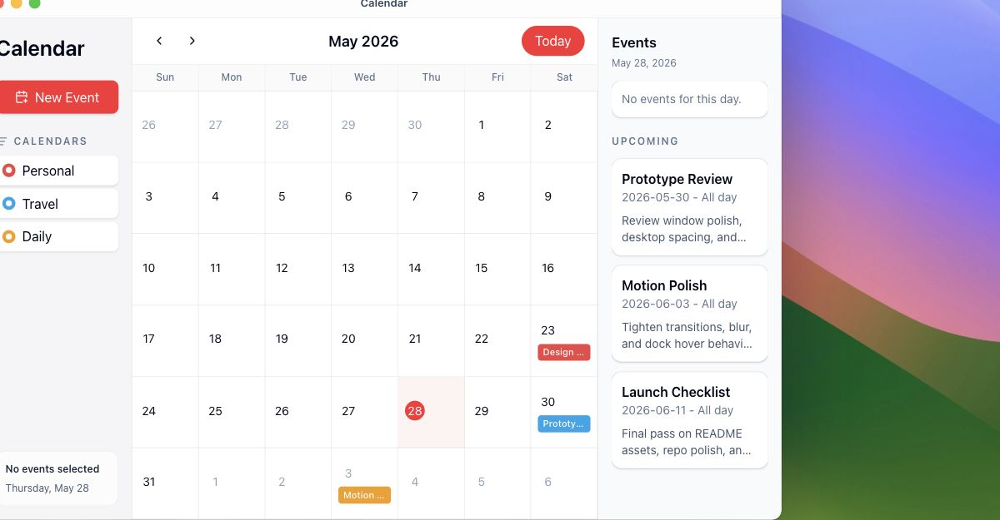
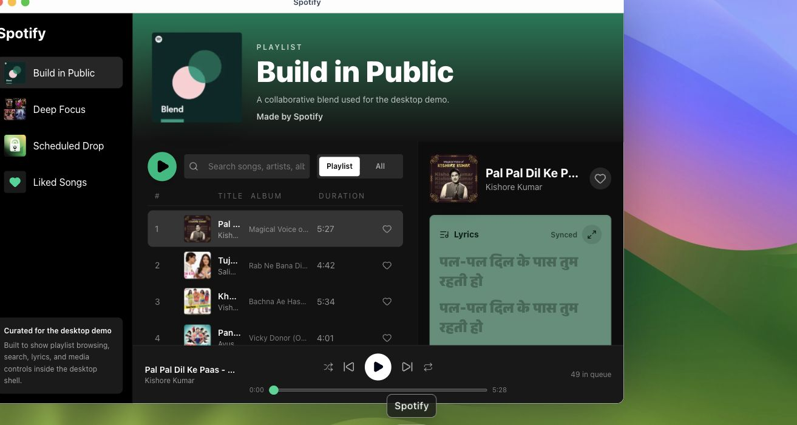
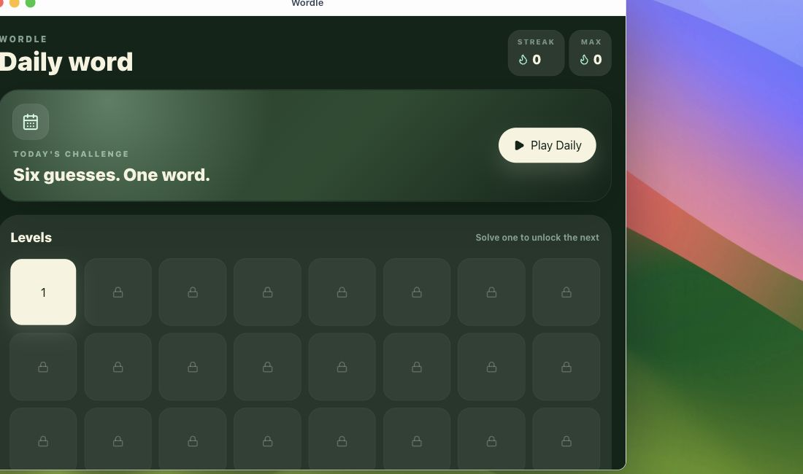
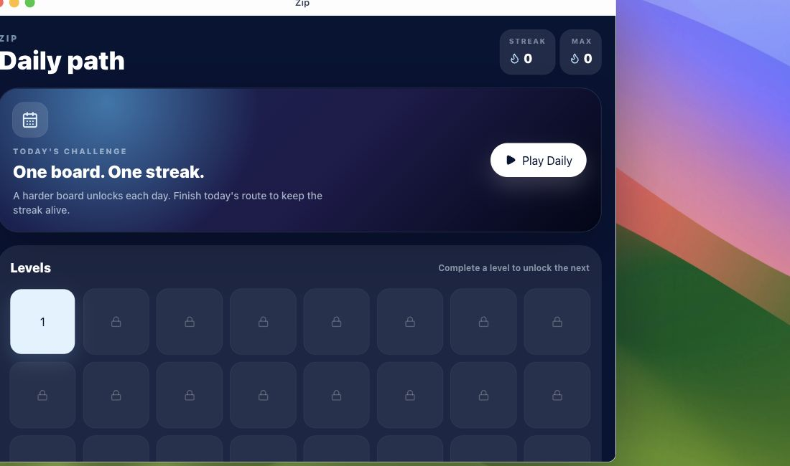

# macOS on Web

`macOS on Web` is a macOS-style web simulator built in Next.js. It recreates a desktop-style UI in the browser with a lock screen, desktop shell, draggable windows, dock/menu bar behavior, bundled demo apps, local-first content, and optional Supabase-backed event logging.

This repo is a proof-of-work artifact, not a polished product. The goal is to show the UI systems, app interactions, and technical decisions behind a desktop-style web interface in a way that is understandable to strangers.

## What It Does

- Simulates a macOS-style desktop environment in the browser
- Includes a lock screen, desktop shell, dock, menu bar, notifications, wallpaper switching, and draggable/resizable windows
- Bundles demo apps for notes, calendar, gallery, camera, calls, weather, settings, chat, files, and a fake music player with synced lyrics
- Includes custom minigames and puzzle systems with generation and solvability checks
- Keeps demo content local-first while exposing optional Supabase admin/event logging hooks

## Why I Built It

I wanted a compact proof-of-work project that shows frontend systems thinking, interaction design, state management, and product taste in one artifact. Rather than building isolated UI components, I wanted to build a browser-based desktop shell where every piece had to work together: lock screen, windowing, media playback, demo apps, persistence, and instrumentation.

## Features

- Lock screen with password flow and camera-unlock demo
- Desktop shell with wallpaper selection, dock, menu bar, notifications, and app launching
- Draggable, focusable, resizable window system
- Bundled demo apps for notes, calendar, gallery, camera, chat, calls, weather, files, settings, and an app store
- Fake music app with local audio, generated artwork, playlist state, and timed lyrics
- Puzzle/minigame surfaces for Wordle, Zip, and Arrow Escape
- Puzzle generation helpers plus validation and solvability checks
- Local-first demo content with optional background sync and analytics logging
- Supabase-backed admin dashboard for sessions, activity events, captures, unlocks, notes, and music events

## Tech Stack

- Next.js App Router
- React
- TypeScript
- Tailwind CSS
- Motion
- Zustand
- Supabase
- Vitest
- Playwright

## Architecture

- `src/features/shell`: lock screen, desktop shell, dock, menu bar, notifications, windowing
- `src/features/apps`: app-specific UI and behavior
- `src/content/apps`: local demo content for each bundled app
- `src/features/puzzles`: game logic, puzzle rendering, validation, and progression
- `src/lib/analytics` and `src/features/admin`: event logging and admin surfaces
- `public/`: generated demo assets used by the public build

## Interesting Technical Decisions

- Local-first content model: the UI works against bundled demo data, so the full simulator is understandable without external services.
- Optional cloud instrumentation: Supabase powers admin/event logging when configured, but the primary UX still works without it.
- Shared desktop systems: lock screen, notifications, wallpaper preferences, and window state are implemented as reusable shell primitives.
- Generated safe assets: demo wallpapers, album art, avatars, and audio were created to preserve the interaction model without shipping private assets.
- Puzzle validation: minigames are not just hardcoded screens; they include generation helpers and solvability checks to make the demo logic more credible.
- Fresh public history: this repo was published with a brand-new public git history rather than carrying over private project history.

## Setup

1. Install dependencies:

```bash
npm install
```

2. Copy the env template if you want custom values:

```bash
cp .env.example .env.local
```

3. Start the dev server:

```bash
npm run dev
```

4. Open `http://localhost:3000`

Demo passwords:

- Default session: `demo-access`
- Test session: `demo-test`
- Admin dashboard: `demo-admin`

## Checks

```bash
npm run lint
npm run typecheck
npm run test
npm run build
npm run e2e
```

## Screenshots

### Lock Screen



### Desktop Shell Overview



### Dock Hover State



### Notes App



### Settings App



### Calendar App



### Music App With Lyrics



### Wordle Levels



### Zip Levels



## Known Rough Edges

- The project is optimized as a proof-of-work artifact, not a production-hardened product.
- Some app content is intentionally simple because the repo uses safe bundled demo data instead of richer private assets.
- The desktop metaphor is broad, so a few interactions prioritize coverage and clarity over pixel-perfect polish.
- The admin dashboard is useful for demonstrating instrumentation, but it is still demo-grade.

## Public Repo Notes

- This is a proof-of-work artifact, not a polished product.
- The repo is intentionally framed as a macOS-style web simulator, not a personal archive or story-driven product.
- If you fork it, keep using neutral demo content unless you explicitly want to personalize your own version.
